### 🏠 NestFind Overview
🔷 NestFinder - ASP.NET MVC PG/Hostel Finder Web Application

NestFinder is a web-based platform developed using ASP.NET MVC and Entity Framework, designed to help users find and post Paying Guest (PG) or Hostel accommodations with ease. It acts as a bridge between people looking for a place to stay and those who have accommodations to offer.

The platform supports two user roles:

General Users who can register, browse, post, and interact.

Admins who verify properties, manage users, and handle reported content.

---

## 📸 Demo Screenshot

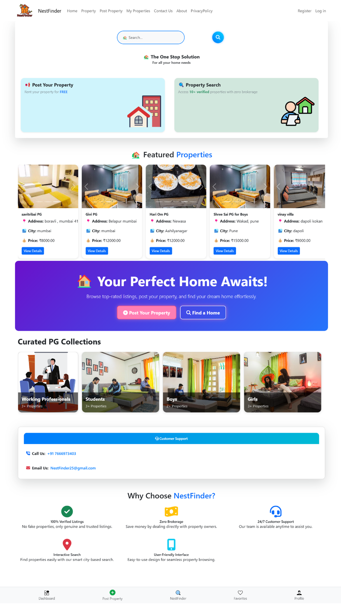

---

## 📌 Table of Contents

- [Features](#features)
- [Tech Stack](#tech-stack)
- [Getting Started](#getting-started)
- [Admin Credentials](#admin-credentials)
- [Database Design](#database-design)
- [Project Structure](#project-structure)
- [Challenges Faced](#challenges-faced)
- [Future Scope](#future-scope)
- [Developer Info](#developer-info)

---

## ✨ Features

### 🧑‍💼 User Module

- User Registration & Login (ASP.NET Identity)
- Post new PG properties with full details
- Add rooms to properties
- View, search, and filter PGs
- Favorite properties for quick access
- Comment and rate properties
- Basic user-to-user chat
- Manage personal profile and properties

### 👮‍♂️ Admin Module

- Admin Dashboard with total stats
- Approve or reject user-posted PGs
- Promote/block/delete users
- Cascade delete: remove all user content on deletion
- View reports and top contributors
- Reply to user contact queries using SMTP

---

## 🧰 Tech Stack

| Technology         | Use                      |
|--------------------|---------------------------|
| ASP.NET MVC        | Web Application Framework |
| Entity Framework   | ORM for DB operations     |
| SQL Server         | Backend Database          |
| ASP.NET Identity   | User Authentication & Roles |
| Bootstrap          | UI Styling                |
| jQuery + AJAX      | Dynamic UI Interactions   |
| Gmail SMTP         | Contact Form + Notification Emails |

---

## 🚀 Getting Started

### 1. Clone the Repository

```bash
git clone https://github.com/Sudhir0603/NestFinder.git
cd NestFinder

```
2. Set up SQL Server
Create a database in SSMS named NestFinder25252

Use the connection string in Web.config:
<connectionStrings>
  <add name="DefaultConnection" 
       connectionString="Server=localhost\\MSSQLSERVER07;Database=NestFinder25252;Trusted_Connection=True;MultipleActiveResultSets=true" 
       providerName="System.Data.SqlClient" />
</connectionStrings>
##   🔑 Admin Credentials
The admin account is auto-created during application startup in Startup.cs.

Email:    nestfinder2026@gmail.com
Password: AdminHa@123

# You can modify this logic in:
App_Start/Startup.cs
→ CreateAdminUserAndRole()


## 🗃️ Database Design (Key Tables)
AspNetUsers – User credentials + profile info 

Properties – PG property data

Rooms – Rooms under each property

Comments – User comments per property

Ratings – Ratings per property

Chats – Messages between users

ContactQueries – Contact form submissions


### 📂 Project Structure

Models/ – Entity classes

Controllers/ – Logic for each module (PropertyController, AdminController, RoomController, etc.)

Views/ – Razor Pages for all features

App_Start/ – Startup configuration (Startup.cs)

Content/ – CSS, images, and static assets

Scripts/ – jQuery, AJAX, Bootstrap JS


### ❗ Challenges Faced

Role-based access control with ASP.NET Identity

Secure password and email handling

Cascade deletion to maintain database integrity

Managing file/image uploads for properties

Complex filter combinations in property search


### 🔭 Future Scope
🌍 Google Maps integration to display property location

💬 Real-time chat using SignalR

📅 PG booking and visit scheduling system

💳 Payment Gateway for deposit/booking

📱 Cross-platform mobile app using .NET MAUI


### 🖼️ Project Screenshots

### 🔐 Login & Registration
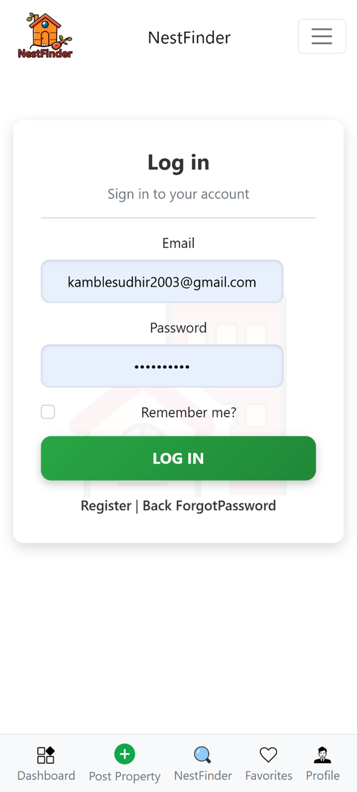 

### 👤 Profile View & Edit
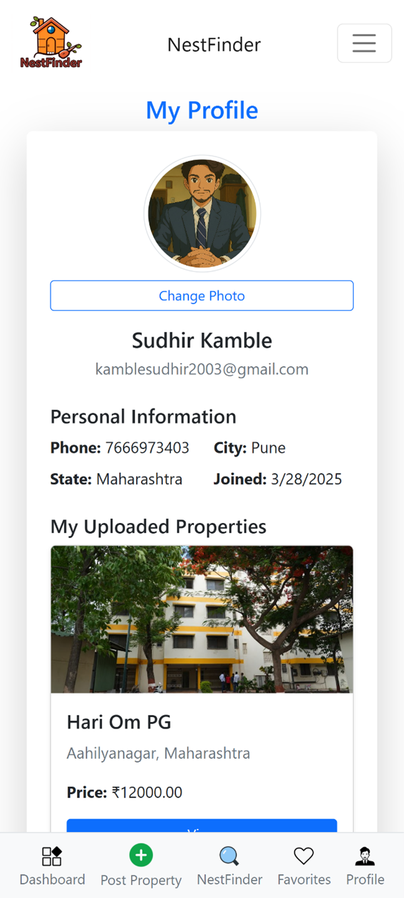 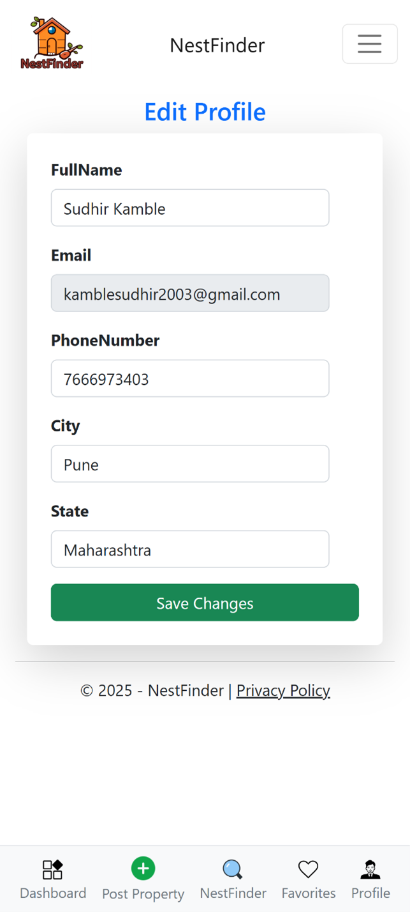

### 📊 Dashboard, Property Post & Add Rooms


###  🏡 Property Details View
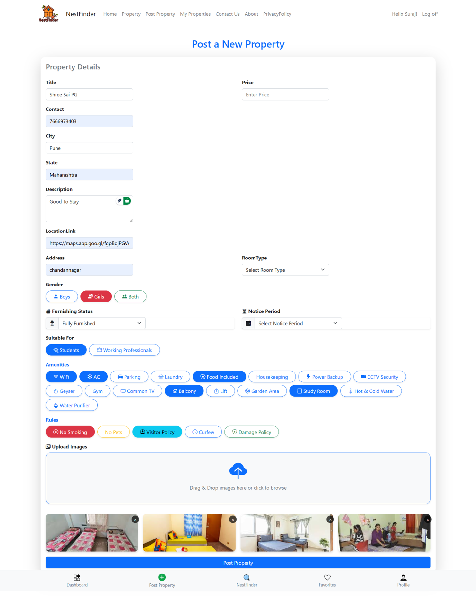

### 📝 My Uploaded Properties
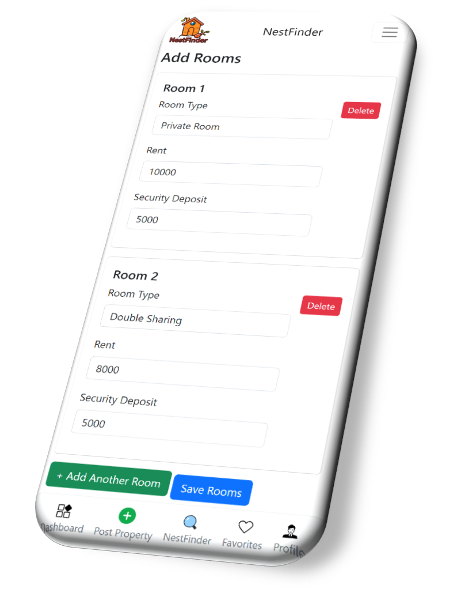

### 🛠️ Edit Property
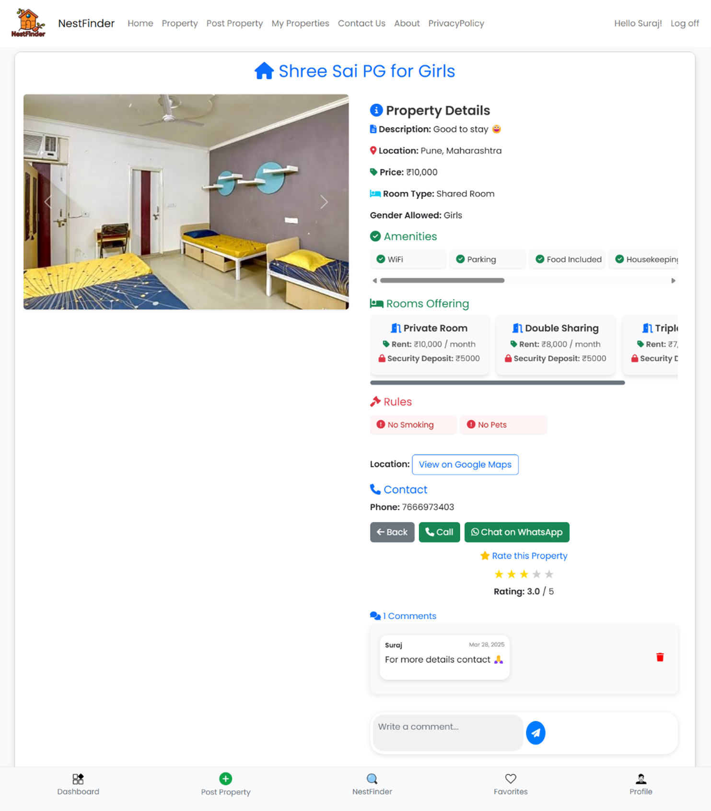

### ❤️ Property List & Favorites
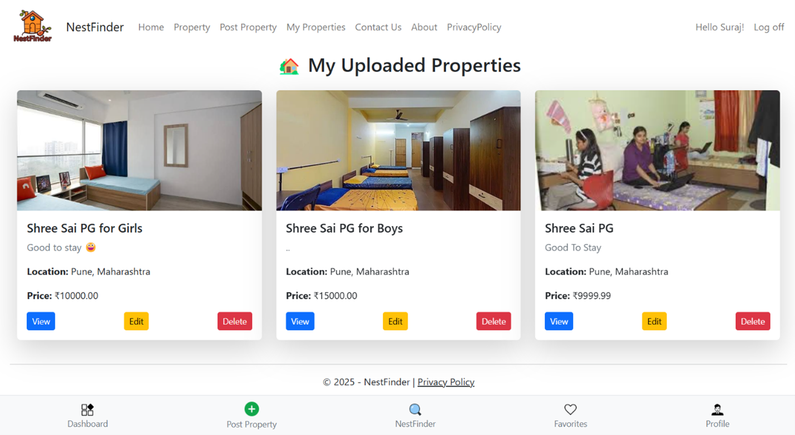 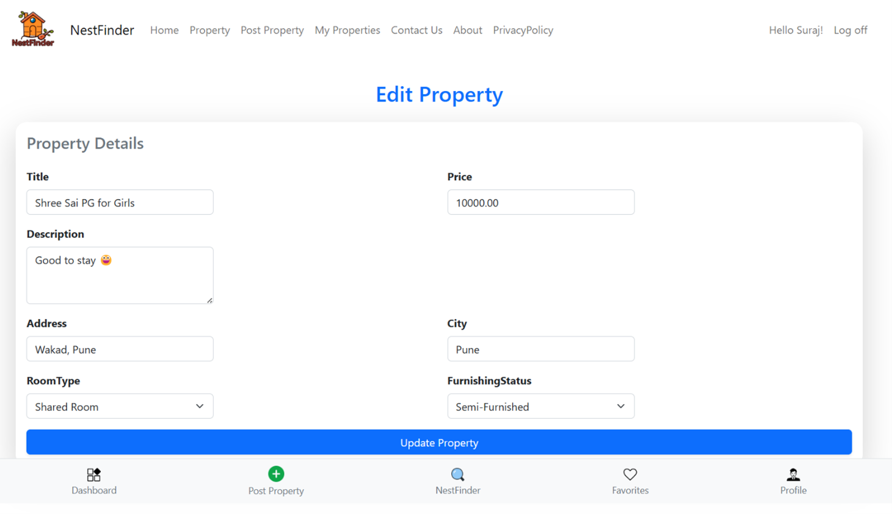

### 🔍 Property Search with Filters
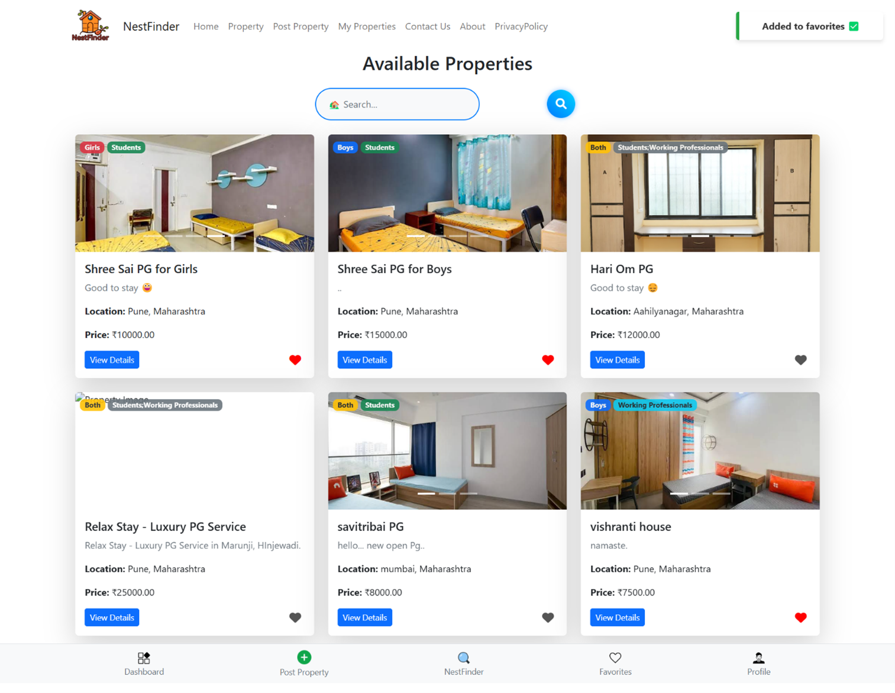

### 🧑‍💼 Admin Panel, Reports & User Control
 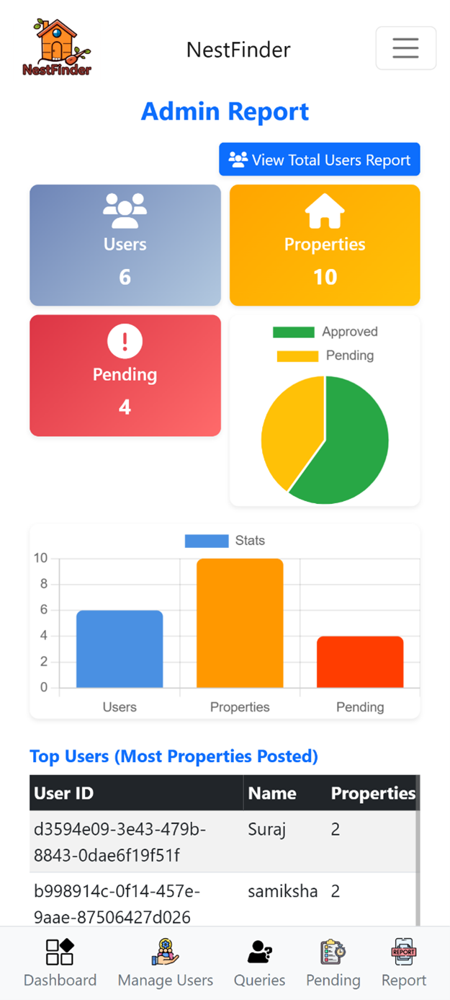

### 📬 Contact Form & Admin Queries
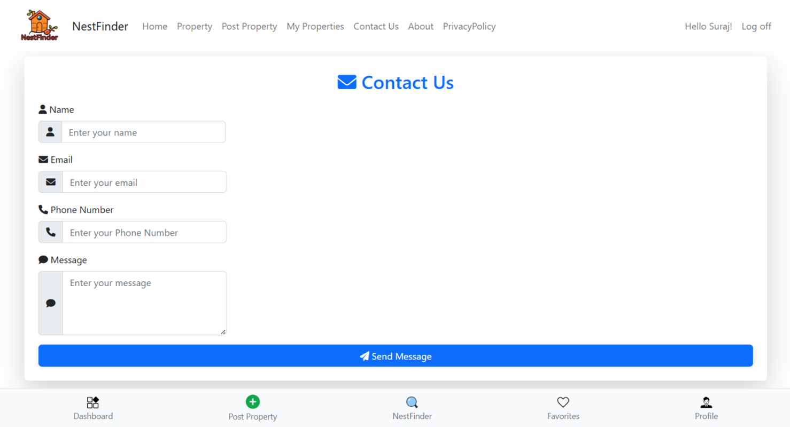 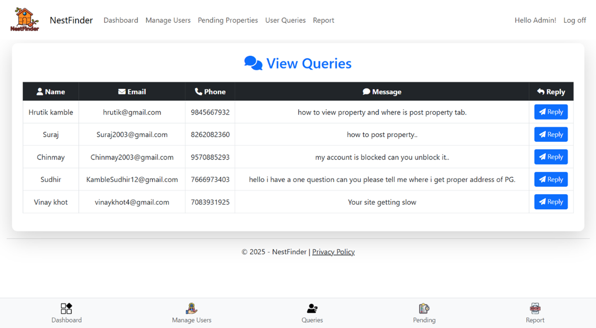

### 📈 User Management (Admin)
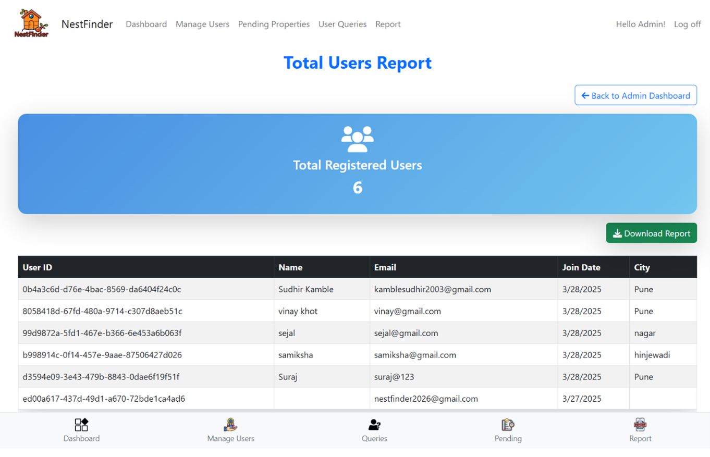

### 🔒 Privacy Policy Page


### 👨‍💻 Developer Info
Created by: Sudhir Ashok Kamble
📧 Email: sudhir.kamble0603@gmail.com

🌟 If you found this project useful or interesting, don't forget to ⭐ the repo!
